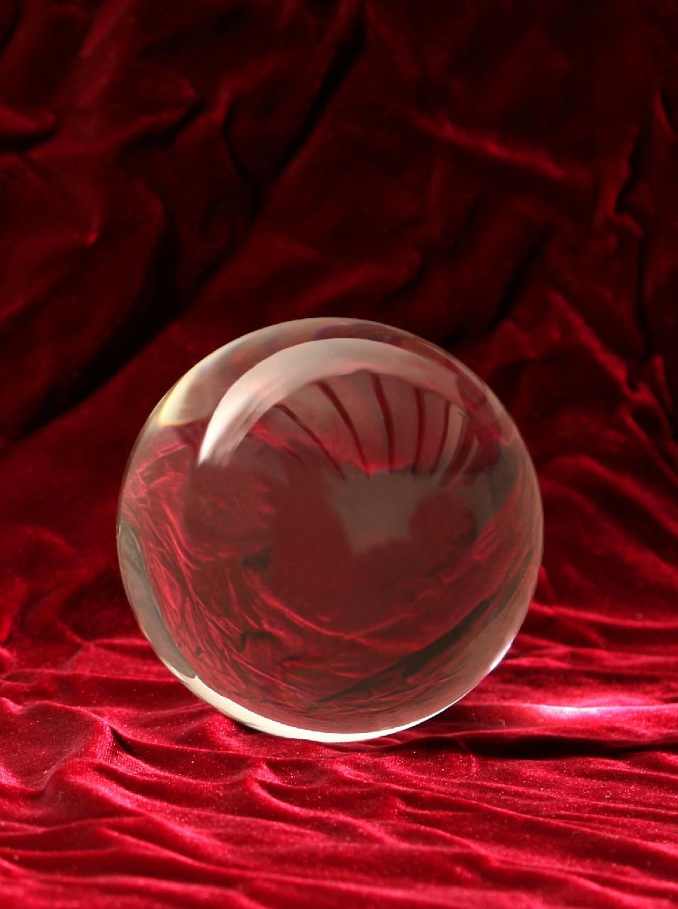

<!-- Put the name of the project after the # -->
<!-- the # means h1  -->
# Nasib in the jQuery Crystal Land!

<!-- Put a description of what the project is -->

This fun project is all about diving deeper into see of javaScript and jQuery to create dynamic websites!

Using the sweet language of javascript and the rich library of jQuery and its powerful built-in functions, I created this Crystal game in which DOM is manipulated in real-time and interacts dynamically with the user.
 

# Link to deployed site
<!-- make a link to the deployed site --> 
<!-- [What the user will see](the link to the deployed site) -->

[NASIB in jQuery Crystal Land!](https://nasibnia.github.io/CrystalGame/)


# Images
<!-- take a picture of the image and add it into the readme  -->
<!--  -->



# technology used
<!-- make a list of technology used -->
<!-- what you used for this web app, like html css -->

<!-- 
1. First ordered list item
2. Another item
⋅⋅* Unordered sub-list. 
1. Actual numbers don't matter, just that it's a number
⋅⋅1. Ordered sub-list
4. And another item. 
-->
- HTML
- css
- Bootstrap
- jquery
- javascript


# code snippets
<!-- put snippets of code inside ``` ``` so it will look like code -->
<!-- if you want to put blockquotes use a > -->

```
$(".cryst").on("click",function(){
	if (!isLock){

		score += parseInt($(this).val());
		$("#scoreId").html(score);
		console.log(score);
		if ( score === bigNumber){
			win++;
			$("#winId").html(win);
			isLock = true;
		}
		if (score > bigNumber){
			loss++;
			$("#lossId").html(loss);
			isLock = true;	
		}
	}				
});

$("#resetId").on("click",function(){
	reset();
});
```


# Learning points
<!-- Learning points where you would write what you thought was helpful -->
- html
- css
- Bootstrap
- event listening functions
- on-click events
- jquery
- javascript
- DOM manipulation


# Author 
<!-- make a link to the deployed site and have your name as the link -->
Nasibeh Nourbakhshnia
(www.linkedin.com/in/nasibehnourbakhshnia)

# License